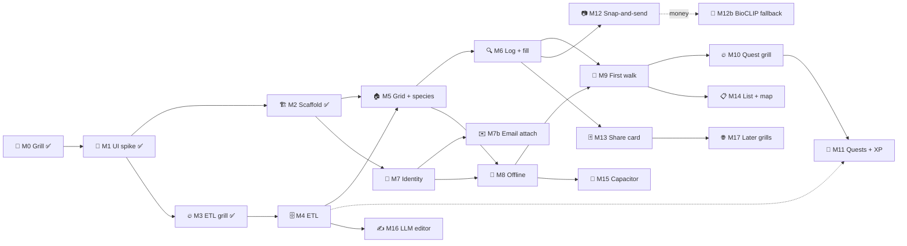

# 🗺️ Roadmap — standkreis-dex

> One table, kept current. A milestone is done when its "done when" is true and its findings or record is in `docs/`. Grills (🔥) produce records and spec sections, not code.

| 🗓️ Updated | 👤 Owner | ➡️ Next |
| --- | --- | --- |
| 2026-09-06 | Sven Reiser | **M9 🚶 the first walk**: live at [atlas.standkreis.de](https://atlas.standkreis.de) with Mainz-Bingen; the owner walks, the frictions become handoff 0012. Known: onboarding search shows "One moment" forever on a server error; a sighting page is blank offline until opened online once. [DEPLOY.md](DEPLOY.md) |

## 📍 Milestones

| # | Milestone | Slice | Done when | Depends on | Status |
| --- | --- | --- | --- | --- | --- |
| M0 | 🔬 Grill | pre | [Record 0001](records/0001-standkreis-dex-the-first-walk.md), [spec 0001](specs/0001-standkreis-dex-the-first-walk.md) | — | ✅ 2026-09-04 |
| M1 | 🎨 UI spike + review | pre | Spec §🎨 chosen, [review 0003](handoffs/0003-ui-spike-review.md) closed | M0 | ✅ 2026-09-04 |
| M2 | 🏗️ Scaffold | 1 | Next.js PWA, tokens, tRPC, Prisma, i18n de/en, spike deleted ([findings 0004](handoffs/0004-scaffold-findings.md)) | M1 | ✅ 2026-09-04 |
| M3 | 🔥 ETL grill | 1 | Region unit, cut, month rule, image ladder, rank rule decided on real data ([record 0002](records/0002-etl-the-plausible-set.md), [findings 0005](handoffs/0005-etl-grill-findings.md)) | M1 | ✅ 2026-09-05 |
| M4 | 🗄️ ETL + plausible set | 1 | Spec §🗃️ runs: taxa, plausibility per region with twelve month shares, assets with licence, text, GloBI edges, look-alikes in Postgres. Mainz-Bingen's grid feels like Saturday to the owner | M3, M2 schema updated to the new ERD | ✅ 2026-09-05, [findings 0006](handoffs/0006-etl-and-identity-findings.md) |
| M5 | 🏠 Atlas grid + species page | 1 | Onboarding sets region and tiles, grid with search bar, filter drawer and "nur jetzt" chip, species page from four sources, honest empty states, mark studied | M2, M4 | ✅ 2026-09-05, [findings 0007](handoffs/0007-atlas-grid-and-species-findings.md) |
| M6 | 🔍 Log + fill | 1 | Chooser, backbone search, wild/captive save, fill sheet, Tagebuch by day, E13 for species outside the set, "Entdeckt" on the species page | M5 | ✅ 2026-09-05, [findings 0008](handoffs/0008-log-and-journal-findings.md) |
| M7 | 🔐 Identity + data | 1 | Anonymous id, passkey/email sync, export JSON, delete, Du with counters and settings | M2 | ✅ 2026-09-05, [findings 0006](handoffs/0006-etl-and-identity-findings.md) |
| M7b | ✉️ Email attach | 1 | Verify an address through **Resend** (EU region) with a six-digit code typed into the app (not a link: the installed PWA and Safari do not share cookies), adopts the identity like a passkey does, second recovery path. Needs the production domain for DKIM | M7, domain | ✅ 2026-09-07 ([findings 0020](handoffs/0020-email-attach-findings.md)), C8 by the owner 2026-09-07: mail in the inbox, code accepted |
| M8 | 📴 Offline | 1 | Atlas for the active filter opens with no network, sightings queue and sync | M5, M7 | ✅ 2026-09-05 ([findings 0009](handoffs/0009-offline-findings.md)) |
| M8b | 🚀 Deploy | 1 | The app on Vercel (`fra1`, Node 24) with Neon Postgres and Blob photos at `atlas.standkreis.de`, RP id the apex; the phone reaches the app from a field ([DEPLOY.md](DEPLOY.md)). The VM deploy of [handoff 0010](handoffs/0010-deploy.md) was proven, then removed (Hetzner refused the card; restore: `git checkout 113a630 -- deploy`) | M8, domain | ✅ 2026-09-06, [findings 0011](handoffs/0011-vercel-findings.md); C6 on the phone passed (photo persists, out-of-set content lands) |
| M9 | 🚶 The first walk | 1 | The owner uses it on one walk and opens it again the next day ([handoff 0012](handoffs/0012-first-walk.md): Track 0 fixes two known frictions, then the walk, then the triage) | M6, M8b | ✅ 2026-09-06, closed by the owner after a short walk; the next-morning rule waived. **The finding: without species recognition, logging on the path is guessing.** Pre-walk frictions: [0013](handoffs/0013-onboarding-second-pass-findings.md), [0014](handoffs/0014-ui-second-pass-findings.md) |
| M9b | 📇 Steckbrief | 1–2 | The species page teaches: **data** (Größe, Alter, Nachwuchs, Lebensraum, Zug, Status from keyed open sources: EOL TraitBank, IUCN API, Wikidata, AnAge), **voice** (Xeno-canto clip with recordist and licence on the row), **prose** (an LLM editor writes two or three paragraphs per species from Wikipedia, GloBI and the facts, every sentence cited, cached in the DB once per species). Grill first: sources, licences, cost per species, schema change for facts and prose. Owner 2026-09-06: "as of now it's boring, almost no info to actually learn" | M9, M4 | 🛠️ **part 1 built 2026-09-07** ([findings 0021](handoffs/0021-steckbrief-data-and-voice-findings.md)): 13 fact keys from AVONET, EltonTraits, PanTHERIA, AmphiBIO, GIFT and the Wikidata mycomorphbox, English names from GBIF, one xeno-canto clip per bird, frog, grasshopper and bat with a play row; C8 (the phone) is the owner's. **Prose grilled twice, verdict wait** ([findings 0026](handoffs/0026-prose-grill-findings.md), 4.73 $): the closed-world prompt on Sonnet 5 brings unsupported sentences from 17.7 % to 4.4 % (≈ 1.9 % real leaks by hand), Opus 5 is no better at 1.6× the price, Haiku 4.5 leaks 12.9 %; the Ökologie paragraph carries 11 embarrassing sentences in ten (GloBI metaweb `eats`/`eatenBy` rows: ducks eating salamanders, ladybirds eating nettles). **Re-grilled on the plan** ([findings 0027](handoffs/0027-prose-regrill-findings.md), 49 Sonnet subagents, 0 $): GloBI edges pruned by study (metaweb-only and one-record pairs out), direction templates per edge kind, judge and validator fixed → Steckbrief 0 of 202 sentences unsupported, Ökologie 0 embarrassing of 110 by hand. **Verdict build**: `Taxon.prose JSONB` with `inputHash`, one driver seam with `files` (plan, ≈ 240 subagents per region) or `api` (a separate key, ≈ 22 $ per region); the owner picks the driver before handoff 0028 |
| M10 | 🔥 Quest + recap grill | 2 | Generator rules, repeat avoidance, the two-question recap, XP curve | M9 | |
| M11 | 🧭 Quests + recap + XP | 2 | Three weekly quests, recap unlocks studied XP, Du with level, "kommt bald" replaced | M10, M9b (the recap asks about the Steckbrief) | |
| M12 | 📷 Snap-and-send | 2–3 | Claude Sonnet 5 held to the region's set with a single/several/none gate, the explaining ladder, the close-shot sentence, outbox when offline ([record 0003](records/0003-id-engines.md), [handoff 0016](handoffs/0016-snap-and-send.md)). Pl@ntNet dropped from v1 | M6 | 🛠️ built and live 2026-09-06 (Tracks A+B, [findings 0016](handoffs/0016-snap-and-send-findings.md)); ✅ after the walks in Mainz-Bingen, Südwestpfalz and Schagen |
| M12b | 🧬 BioCLIP 2 fallback | 1 | **Only when Sonnet gets too expensive** (≈ 430 photos/month) or a region needs the photo to stay on own hardware: run C of [findings 0015 §🧬](handoffs/0015-snap-and-send-grill-findings.md) on a Hetzner CX23, record 0003 §🔁 | M12 | parked, owner 2026-09-06 |
| M13 | 🃏 Share card | 3 | Render route, coarsened location, no XP on the card | M6 | |
| M14 | 📋 List + map views | when the grid is proven | Toggle already has its place; the 10 km cell lives on the map | M9 | |
| M15 | 📱 Capacitor wrap + stores | when a second user wants it | Camera, GPS, SQLite, haptics via plugins | M8 | |
| M16 | ✍️ LLM editor | folded into M9b | Ecology prose from the graph with citations; removes the CC BY-SA intro | M9b | |
| M17 | 🌐 Later grills | later | Sessions, places, friends, feed, BirdNET, iNat export, fish tile cut, image takedown path | M13 | |

## 🔗 Dependencies

## 📝 What earlier milestones changed

| Grill | Changed for later milestones |
| --- | --- |
| M3 | No grid cells: the region is one GADM level-2 polygon, so M4 stores plausibility per region, not per cell. M2's Prisma schema needs `Region`, `Asset` licence fields, the 12 month shares and the 8-tile enum before M4 writes into it |
| M3 | Month is a sort and a chip, not a filter on the denominator: M5's filter drawer loses "Zeitraum" |
| M3 | Lebensraum leaves the Steckbrief; intro falls back de → en; species outside the set get content on first log (M6) |
| M1 | Studied earns XP only after the recap, so M11 owns the XP switch, not M5 |
| M5 | Only Mainz-Bingen and Kyoto are selectable; `dex.requestRegion` exists but is unreachable from the UI until the loop closes (owner). The map shows GBIF density, the 10 km cell waits for M6's own sightings. AnAge fact values are English; OSM tiles need a proxy before launch |
| M6 | The content kick for out-of-set species runs in-process from `taxon.ensure` and is lost on restart (rerun the ETL heals); photos live on disk under `app/data/photos/` behind a capability URL, so M8 owns the queue, a signed URL and the storage question; out-of-set finds fill their cell but do not count (owner decides) |
| M8b | The passkey RP id is the apex `standkreis.de` for good, the app itself serves from `atlas.standkreis.de` (`WEBAUTHN_ORIGIN`), the apex is kept for a landing page; the server refuses to start in production without `WEBAUTHN_SECRET`, `DATABASE_URL`, `PHOTO_DIR`, `WEBAUTHN_*`; OSM tiles go through `/api/tiles`. Vercel replaced the VM (Hetzner refused the card): Neon Postgres on Prod + Preview (dev keeps Docker on 5433), the ETL runs from the Mac over `DATABASE_URL_UNPOOLED`, migrations run only in Vercel's build command, the Docker/standalone path was deleted; photos in `/tmp` do not persist and the in-process jobs die with the function until 0011 lands |
| M8 | `Sighting.id` is minted on the phone and `sighting.create` is idempotent by id; queries persist in localStorage (IndexedDB wedged in the iOS Simulator), the outbox in IndexedDB; `dynamicParams = false` left the locale layout; the region job is still in-process, a restart sweep heals it, no job table; the offline image cache is ~27 MB per region, not 14; the export works from any file server |
| M7 | `Filter` and `Study` rows exist but have no mutation: M5 adds `identity.setFilter`, `study.mark`; the region job runs in-process from `dex.requestRegion` until M8 brings a queue |
| 0018 | Several regions per identity, one active: `Filter.regionIds` (migration `20260907000000_filter_regions`, backfilled from `regionId`), `identity.setRegion` as the one-tap switch, `setFilter` takes the list; the "Meine Regionen" sheet from the profile, the atlas header pill and the drawer's Ändern replaces every link to the onboarding's change mode; `dex.regions` carries `nowCount` and is persisted; an offline switch is replayed from `dex.region.pending`. A union grid, per-region tiles and new regions from the UI stay out |
| 0022 | The profile's progress section reworked ([findings 0022](handoffs/0022-progress-rework-findings.md)): `ProgressCard.tsx` replaces the counters card and the groups card, one card per region of the list (active first and open, the others folded), an `Entdeckt | Studiert` switch remembered in `localStorage['dex.progress.axis']` sets which axis every bar and bold number show, a group bar only from 5 %, rows at 0 fold under "n weitere Gruppen", "Ganzes Jahr" is gone from the profile; `dex.setCounts` (ids per tile, no species rows) is the light read for the regions that are not active and is persisted. Atlas header, quests, XP, the "jetzt" filter on the profile stay out |
| 0023 | Grouping on the atlas ([findings 0023](handoffs/0023-atlas-grouping-findings.md)): a third URL axis `?group` next to `show` and `sort` (`exploration` default, `tile`, `none`), sections Entdeckt → Studiert → Noch nicht (seen wins, empty sections skipped) or the tiles in the enum order, one sticky full-width header row inside the one CSS grid (`.atlas-group`), the chosen sort kept inside every section, out-of-set finds trailing; the drawer's "Gruppieren" section does not raise the badge. 929 tiles render in ~80 ms from the persisted store, scroll at 60 fps, no virtualisation; the sticky top on the phone is C10 |
| 0024 | The two AnAge Steckbrief cells (`lifespan`, `reproduction`) carry codes instead of English ([findings 0024](handoffs/0024-anage-codes-findings.md)): the ETL writes `21.8 wild` and `clutch 4.5 · perYear 2 · maturity 365`, the page translates through `species.facts.values.lifespan|reproduction`, `npm run etl -- recode` rewrites what the database already holds (dev: 145 taxa) |
| 0025 | The doubt sweep ([findings 0025](handoffs/0025-doubt-sweep-findings.md), tracks [A](handoffs/0025-doubt-sweep-findings-a.md) · [B](handoffs/0025-doubt-sweep-findings-b.md) · [C](handoffs/0025-doubt-sweep-findings-c.md)): 31 open doubts from findings 0008–0023 fixed or decided in three parallel worktrees. Server: user photos answer only to the owner's cookie, sounds cached immutable, tile proxy capped at 600/min per address, the sweep drops stale email codes, GBIF names on a fresh row, the create race caught. UI: safe-area top, presentational group headers, inert folds, `setCounts` counted on the server, amber-deep at AA, one offline message, the outbox races IndexedDB 5 s, "Arten" not "Gruppen". ETL: WAV clips transcoded with ffmpeg-static, EltonTraits stratum as the bird's second habitat word. 70 tests. Owner: `facts --force` and `sounds` on Neon, phone checklist P1–P5 |
