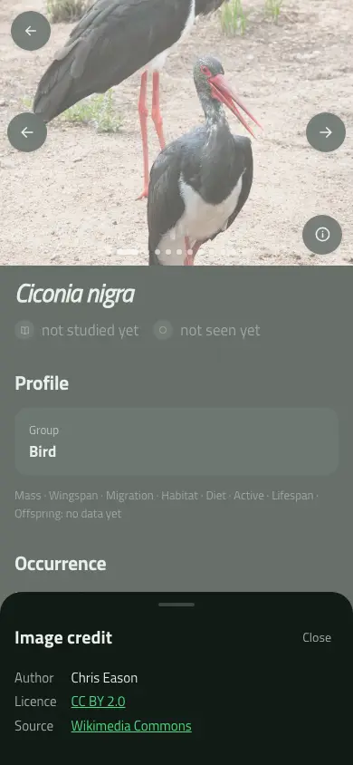
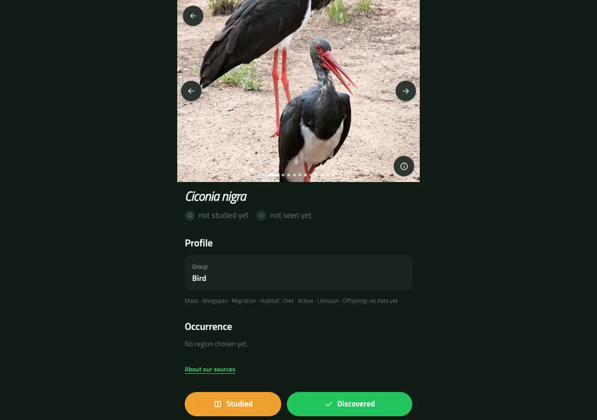
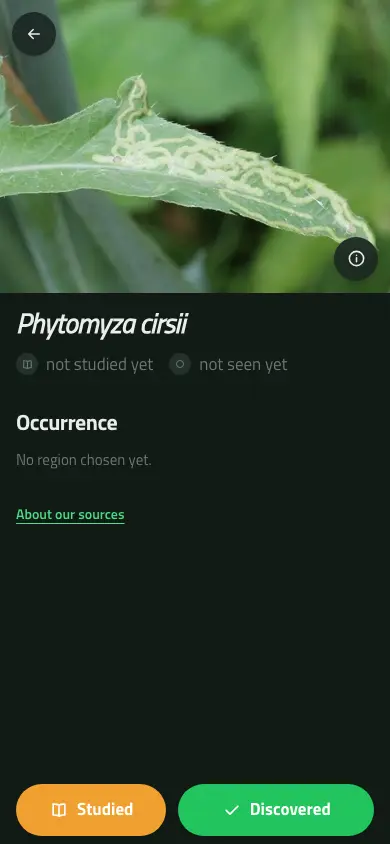
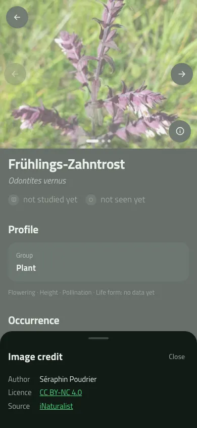
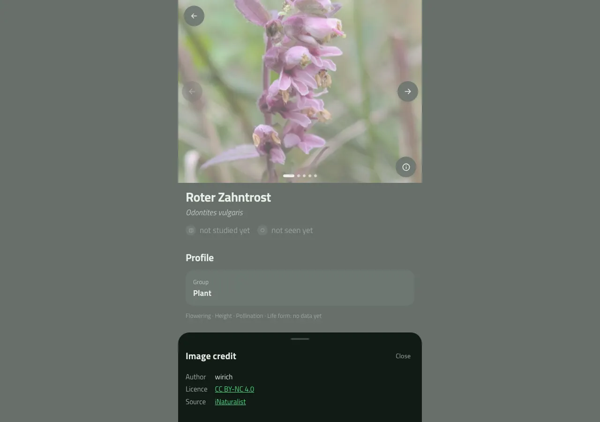

# German content pilot: real-gallery review

Evidence for [#21](https://github.com/Standkreis/atlas/issues/21), 9 September 2026. This is a
pilot checkpoint, not evidence that the complete national content run or production transfer
has finished. The issue and final release audit own those completion gates.

## 🖥️ Actual rendered result

Reviewed the clean-main preview at commit `c4fca71c5ce7006ecbd4e58171e69059dc9b4ebf`, build
`mttsnfi6`, against a disposable copy of the real initial 100-taxon gallery pilot. No synthetic
image fixtures or request interception were used. The copied data predates the names pass and
the licence-URL pilot corrections; scientific-name headings here are expected.

Primary Codex agent inspected the collaborative browser and saved screenshots. Independent
Codex reviewer `/root/audit19_scientific_final` exercised isolated Chrome/CDP at exact
390 × 844 and 1280 × 900 sizes; the collaborative host's requested viewport was scaled and
therefore was not used as exact-width evidence.

| Real taxon | State | Observed result |
| --- | --- | --- |
| Ciconia nigra, GBIF 2481909 | 12 images, iNaturalist and Commons | All 12 decoded at both sizes; selected-image author/licence/source links match stored provenance; Home/End/arrows and endpoint clamps work |
| Phytomyza cirsii, GBIF 1551313 | One image | Decoded at both sizes; source control remains; no unnecessary navigation or counter |
| Megachile pilidens, GBIF 1335229 | Zero eligible images | Explicit “No image yet” fallback; no image controls or misleading empty carousel |

The check verified 26 active-image attribution states across the two viewports. Controls are
44 px, the position announcement is polite, desktop content remains 520 px wide, and no
horizontal overflow was observed. Thirteen distinct real CDN image URLs were loaded. A host
sleep/connectivity interruption affected an earlier attempt; the complete rerun passed after
recovery. It is not evidence of an application defect.

Both black-stork screenshots show Chris Eason's photograph,
[Ciconia nigra – Kruger National Park](https://commons.wikimedia.org/wiki/File:Ciconia_nigra_-Kruger_National_Park-8.jpg),
under [CC BY 2.0](https://creativecommons.org/licenses/by/2.0/), displayed cropped within the
application gallery. Screenshots were resized/encoded to WebP for review evidence.

The single image is a diagnostic leaf mine, not an adult fly. Photograph by Vytautas,
[iNaturalist photo 214407360](https://www.inaturalist.org/photos/214407360),
[CC BY-NC 4.0](https://creativecommons.org/licenses/by-nc/4.0/), displayed cropped and encoded
within this non-commercial review screenshot. Source identifications are not independently
certified by successful rendering or matching attribution links.

## 🔬 Pilot and recovery evidence

The final versioned 100-taxon pilot produced 601 eligible reference images and six completed
zero-image results. Version `licensed-gallery-v3` corrects false rejection of matching legacy
HTTP/localized Creative Commons deed URLs without changing licence family, version or
jurisdiction. Credentials and custom ports are rejected. The unchanged second invocation
examined zero taxa and made zero network requests. The names pilot reused cached Wikidata
responses and added 58 German labels; missing names remain honest scientific-name fallbacks.

A real SIGTERM interruption of the nationwide gallery process at 08:04 UTC left 181 completed
checkpoints and two leased unfinished taxa. Restarting the same command continued other work
without reclaiming live leases. All 181 previously completed records retained their exact
serialized checkpoint digest (`ae84f214d29c8fd42b9b41ab4cb7a854`, PostgreSQL MD5 equality check)
after restart. This equality check is recovery evidence, not an artifact security digest.
Final expired-lease completion and whole-union retry counts remain release-audit gates.

The initial 588 pilot URLs passed HTTP/image-MIME checks. Later local connectivity failures
also affected GitHub and CDN requests; they remain failed/retryable observations, not reasons
to remove taxa or certify zero-image coverage. Final release requires a fresh complete URL
report, independently bound decoded samples and reproducible base/gallery artifacts. Precise
per-process request counters from the deliberately terminated segment were not emitted;
its stderr and database checkpoints are retained, while completed run reports retain their
exact request/cache/retry counts. Do not present that missing segment as zero requests.

## 📊 Whole-union API check (pilot content)

The exact 6,874-key union was enumerated from the disposable preview database and checked via
`taxon.page` with concurrency four. Every key returned HTTP 200 with matching identity,
scientific display fallback, supported tile and a valid bounded gallery; there were no failures
or HTTP 500 responses. The union fingerprint remained
`6ede6e5b059fa0d3d5edc0e883654a1c7ecb2df08abae129c32c9953e25ae38e`.

Local wall time was 8.78 seconds; per-request p50/p95/p99 were 4.9/7.2/8.9 ms. Responses totaled
2,916,356 bytes, with a 5,234-byte maximum. These are local API/transport measurements on the
pilot's 588-image content snapshot, not final-gallery payload measurements, browser rendering
coverage, production latency or CDN transfer bytes. No upstream APIs/images were requested.
The exact-key check must be repeated against the frozen final dataset in #29.

## 🔎 Source-evidence review addendum

At 10:18–10:27 UTC, independent Codex reviewer `/root/audit19_scientific_final` decoded and
visually inspected ten deterministic interim sample images. Both Commons file pages exposed
their file-specific credits and licence versions. Eight iNaturalist photo pages returned a
Cloudflare challenge, including in an ordinary collaborative browser tab. The owner
[approved retained official API records as a distinct source-evidence method](https://github.com/Standkreis/atlas/issues/21#issuecomment-5600270992),
not a claim that blocked public pages had been inspected.

The audit binds retained JSON bytes to the exact official detail request, taxon/photo identity,
image URL, author and licence code. Review still checks the official version mapping, and
sample decoding and complete fresh image-URL checks remain separate gates. The current
[iNaturalist licence module](https://github.com/inaturalist/inaturalist/blob/d65e6756e8c249d9e56798138cd55a90649a2409/app/models/shared/license_module.rb)
maps CC families to version 4.0 and CC0 to 1.0. This establishes its current published mapping,
not every photograph's original historical grant.

That distinction is material: the original [Nimbus contaminatus Flickr photograph](https://www.flickr.com/photos/coleoptera-us/33331825142/)
links CC BY-SA 2.0, while imported iNaturalist photo 61832344 received the common 4.0 mapping.
The API fallback therefore requires detailed native-free provenance; an abbreviated default
photo, a `LocalPhoto` type alone, or an iNaturalist CDN URL is insufficient. A source-record
census at 10:24:06 UTC matched all 8,543 then-collected iNaturalist references: 7,280 had null
native provenance and 1,263 had imported provenance. This is an interim risk census, not a
final gallery count or a claim that every imported image has an incorrect licence.

The [issue records the release-blocking finding and pending collection-policy decision](https://github.com/Standkreis/atlas/issues/21#issuecomment-5600392398).
No source-policy change, automatic rights relabelling or production transformation is implied
by this evidence. Final samples must be selected again and bound to the frozen content snapshot.

## 🛡️ Approved conservative policy — 12:20 UTC addendum

The owner subsequently [approved excluding imported candidates from new galleries unless
their original licence is verified](https://github.com/Standkreis/atlas/issues/21#issuecomment-5601624909).
Version `licensed-gallery-v4` requires consistent detailed same-photo-ID records with
`LocalPhoto` type and explicitly null native provenance. Default-photo metadata can inherit
that proof but cannot establish it. Imported or contradictory candidates are withheld with
`unverified-imported-licence`; missing detailed proof is `unknown-provenance`. Metadata-only
contradictions are flagged separately in the evidence: not every rejection proves an import.
All records participate in classification, with bounded checkpoint evidence and complete raw
responses retained in the cache. No original-source licence verifier or rights relabelling is
introduced. Independently sourced Commons candidates remain available.

The v4 cache-only 100-taxon pilot completed with 502 images (436 iNaturalist, 66 Commons), ten
zero-image outcomes, 44 changed and 56 unchanged galleries, no failures and no network requests.
An immediate unchanged repeat examined zero taxa and made zero network requests. The source
preservation digest still matched all 6,924 protected Taxon records and the eleven protected
table selections; empty local personal tables do not prove production preservation.

The old v3 worker was stopped before the v4 national run. Its completed, failed and unfinished
lease rows remain historical evidence, not current release completion. The national v4 run
uses bounded batches with individual request reports; source responses and prior checkpoints
survived the host crash. All 6,874 union taxa remain in scope, including honest no-image
fallbacks. Existing production photos remain governed by the separate preservation-first
migration plan. Final national counts, frozen samples and transfer approval are still pending.

## 🔬 Bounded naming ambiguity review — 13:15 UTC addendum

Independent Codex reviewer `/root/audit19_scientific_final` reviewed the twelve ambiguous or
non-species naming outcomes present at this interim snapshot. All twelve retained scientific
fallbacks and empty common-name selections; no guessed label was published. Six associated
Commons references matched the selected species-ranked item's file and retained credit/licence
metadata. No confirmed application naming or Commons-assignment defect was found. This is a
bounded source-record review, not a final nationwide ambiguity count or decoded-image review.

Nine cases showed spelling or gender-ending variants. The other cases must not be flattened
into generic duplicates: *Melitaea diamina* had a species/subspecies identifier collision;
*Fragaria ×ananassa* had a species/nothospecies rank collision; and *Rubus fruticosus* had an
explicit homonym collision. The Fragaria item rejected by the species-rank gate is a
nothospecies, not a cultivar. That gate's `non-species` outcome does not invalidate or remove
the accepted hybrid from the catalogue.

For Rubus, the [selected authored record](https://www.wikidata.org/w/index.php?title=Q13541716&oldid=2521608079)
agrees with the GBIF Linnaean name; the
[other same-spelling record](https://www.wikidata.org/w/index.php?title=Q135502823&oldid=2535545416)
is explicitly homonymous, not an established synonym. The
[Commons file-specific source](https://commons.wikimedia.org/w/index.php?title=File:Blackberry_(Rubus_fruticosus).jpg&oldid=1271223496)
supports the stored credit and CC BY-SA 4.0 grant. Source consistency of a detached-fruit
photograph does not independently certify its biological identification. No taxon IDs,
catalogue membership or personal progress were merged from these findings.

The local repeatable-read evidence snapshot is bound by SHA-256
`432dce0de130c1cf730e05d9e4eb97d2ad6c18c33c6b22b5670b08562c11e6e3`.
Raw records remain outside Git. Any additional ambiguous outcomes require review after the
final names pass; final sample decoding and complete fresh URL checks remain separate gates.

## 🔬 Approved image withholding — 16:28 UTC addendum

The owner [approved withholding](https://github.com/Standkreis/atlas/issues/21#issuecomment-5605162646)
Commons `File:Red bartsia 800.jpg` from both new Odontites galleries pending identification.
The source category and description conflict; its CC BY-SA 3.0 grant is not the defect.
The exact source evidence retains SHA-256
`075799c48c4aad347569c306d8acaa84d5ddcb7de89f99fd300ba3018920818f`.
Both accepted taxon identities and catalogue memberships remain unchanged.

Version `licensed-gallery-v5` re-evaluated all 3,588 completed v4 taxa in fifteen bounded
cache-only batches: zero network requests, zero failures, exactly two changed galleries.
The full earlier completed-work snapshot and every unaffected reference Asset row retained
identical before/after digests, including IDs and timestamps. Reference rows changed from
18,897 to 18,895; vulgaris retains five images, vernus three with a new eligible lead.
Old v4 checkpoints and raw source responses remain historical evidence. No production data
was changed. Final whole-union completion and newly bound artifacts remain outstanding.
An immediate unchanged v5 repeat over those same 3,588 keys examined zero taxa and made zero
network requests. Fresh disposable checks passed 71 integration and 370 unit tests, typecheck,
lint (six existing warnings, no errors), 2,413-page static export `mtubbtqy`, production server
build `mtubc8qh`, bilingual phone/desktop journeys and gallery/offline private-cache checks.

The separate names retry completed all 6,874 checkpoints with 72 Wikidata requests, one retry,
zero HTTP 429 responses and zero failed/lost work. This closes the processing backlog, not the
final scientific review of ambiguous outcomes. The iNaturalist hold remains until at least
10 September 14:40 UTC, conditional on no intervening callers.

## 🏷️ Complete names review — 16:30 UTC snapshot

Independent reviewer `/root/audit19_code_review` checked all 25 final ambiguous/rank-gated
outcomes against retained query responses and accepted GBIF records. All 18 ambiguous and seven
rank-gated cases withheld common-name publication; all 25 query and GBIF fingerprints reproduce
their stored evidence. The original twelve cases and their six Commons references retain the
earlier hashes. No new confirmed naming defect was found; this is not biological or lexical
certification of every matched label.

All 6,874 checkpoints are complete: 4,533 matched, 2,316 scientific fallbacks, 18 ambiguous and
seven rank-gated. German labels are usable for 4,436 taxa; 2,438 use scientific-name fallback.
English labels cover 963, Japanese 1,623, and 2,341 taxa have no usable common label in any
language. Language counts overlap. Completed coverage fallbacks are not failed requests.

The thirteen newly reviewed cases have no current Commons assets or retained metadata for
their proposed files; their eventual galleries still need the normal source and final image
review. Salix's hybrid-marker distinction, Helvella's same-label collision and Draba's competing
genus/species ranks cannot be resolved from the retained projections alone. Scientific
fallbacks preserve those identities without guessing. Nothospecies rank rejection remains a
Wikidata enrichment limitation, not grounds to remove an accepted hybrid from the catalogue.

The bounded final names evidence is SHA-256
`a81ae8bcf6b30e0fe3897f4dfd5640c5c44385df43416eba51fcd5e65286702b`;
its Commons-cache follow-up is
`e3956306cb2dfe26a382062c42537b69d25ee052fa3022fb3508d797a8e85979`.
Raw public evidence remains outside Git. This review made no provider requests or data changes.

## 🖼️ Changed-gallery and nationwide response checks — 17:04 UTC addendum

On a separate full-data local clone, build `mtuc4u10` returned all 6,874 `taxon.page` responses
with HTTP 200 and valid identity, name fallback and ordered gallery envelopes. There were no
request failures or HTTP 500s, and the union fingerprint stayed unchanged. This checks API
shape and local transport, not production performance or completion of unfinished galleries.

Reviewer `/root/cache_only_fast_fail` then checked both changed Odontites galleries in isolated
Chrome at exact 390×844 and 1280×900. All eight remaining images decoded at each size (16
states), with exact active author/licence/source metadata and links. Vernus uses photo 49060867
as its new lead; vulgaris retains five images and vernus three. Home/End/arrows, both-end
clamps, 44×44 controls and no horizontal overflow passed. Only eight unique image-CDN URLs
were requested; the withheld Commons image appeared in neither the data, DOM nor network.
No provider API calls or botanical identification claims were made. Root inspected the two
curated captures below. Raw observations and other captures remain outside Git.

A separate zero-budget cache-readiness pass found three additional valid no-image outcomes;
normal scoped replay completed them without requests. Current v5 progress is 3,591 complete
and 3,283 still requiring fresh source requests. Do not interpret API zero-image responses for
unfinished taxa as completed source coverage. The explicit provider hold and final artifact,
URL and representative source-review gates remain unchanged.
