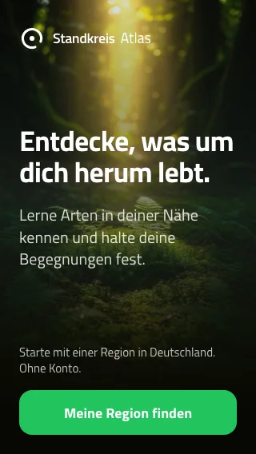
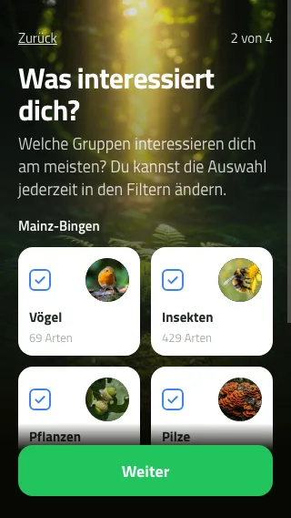
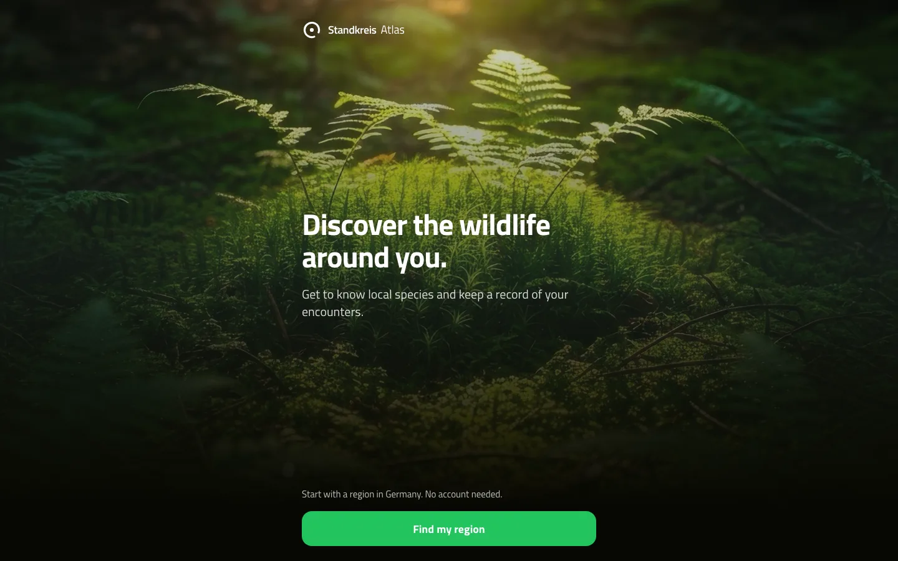

# 👋 Welcome before region discovery

Delivery evidence for [issue #24](https://github.com/Standkreis/atlas/issues/24), reviewed with a disposable local Postgres fixture database on 9 September 2026.

## 🧭 Decisions

- An unnumbered branded welcome introduces the product. Region discovery begins the four setup steps; change mode skips the welcome and repeated commitments.
- Search and explained location use share the reusable picker. Group counts and the ready preview retain the selected regional denominator.
- Group names sit below the checkbox and photo, preserving legibility at 320px. The primary action stays reachable while longer content scrolls.
- Loading and retry are explicit. Offline users can inspect cached choices but reconnect before saving setup. Back navigation preserves group choices.

## 🔬 Evidence

Local verification passed 258 unit tests, 64 integration tests, static export and server builds. English and German production-browser journeys cover keyboard navigation, denied location, search, load failure/retry, offline save handling, back/cancel, change mode, and every primary action at 320×568, 390×844 and 1440×900.

The preview audit supplies an older position-one image alongside the lead. It verifies one shared lead URL, no full-species/gallery request, and no request for the non-lead sentinel. Test metadata and image transport are mocked locally; no upstream image service is called. Existing private-cache purge and public-pack preservation checks also pass.

The collaborative browser phone render and the browser suite's phone/desktop captures were inspected. These are local UI evidence; production delivery is verified separately through the PR deployment and the Germany Atlas milestone.

| Small-phone welcome | Small-phone groups |
| --- | --- |
|  |  |

