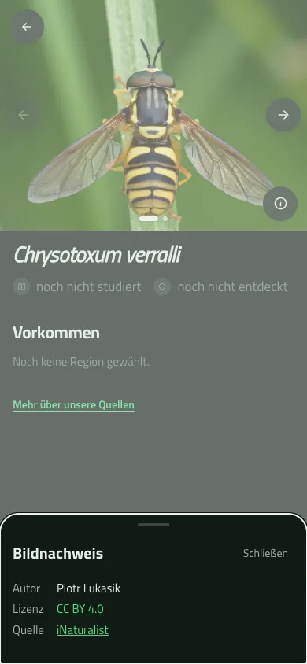
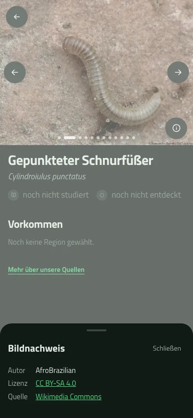
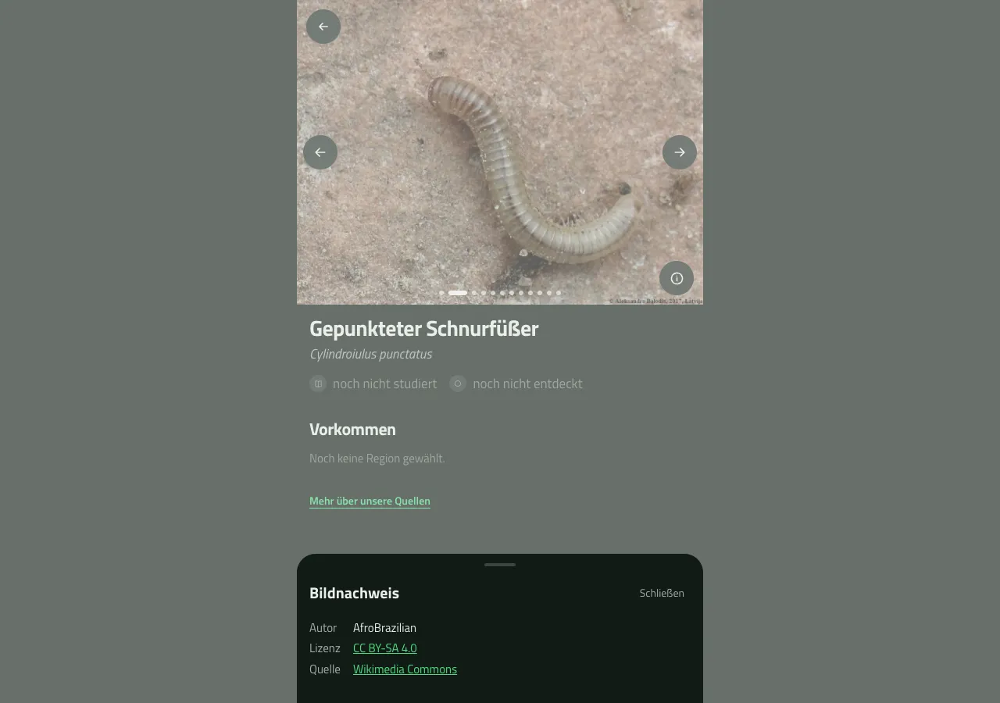

# Germany index-ready content: final local review

Evidence for [#21](https://github.com/Standkreis/atlas/issues/21), 10 September 2026.
This records the reviewed development release candidate, not a production transfer or completion
of [Epic #14](https://github.com/Standkreis/atlas/issues/14). The earlier
[pilot and recovery record](2026-09-09-germany-content-pilot.md) remains historical evidence.

## 🌿 Final coverage

The accepted regional union contains **6,874 taxa, including six accepted hybrids, across 362
Kreisregionen**. The regions compose 400 official Kreis units; their operational crosswalk uses
402 GADM queries. Südwestpfalz contains Landkreis Südwestpfalz, Pirmasens and Zweibrücken.
These are observation-driven regional sets, not an exhaustive inventory of German biodiversity.

| Content | Final local coverage |
| --- | ---: |
| Completed names / current v7 gallery checkpoints | 6,874 / 6,874 |
| Usable German names / scientific-name fallbacks | 4,436 / 2,438 |
| Reference images / taxa with images | 36,338 / 6,450 |
| Completed zero / one / two–eleven / twelve-image galleries | 424 / 566 / 5,733 / 151 |
| iNaturalist / Commons images | 31,590 / 4,748 |
| iNaturalist / Commons leads | 4,746 / 1,704 |

There are no missing, pending, running or failed current names/gallery checkpoints. The 424
zero-image outcomes are completed source searches with no eligible candidate, not processing
failures. The selection retains 15,410 rejection records, including 6,926 unverified imported
licence candidates and eight ambiguous-species assignments. Thirty-six cap rejections are
reported separately within that total. These counts describe candidates, not excluded species.

The new source contains no populated introductions, facts, prose, sounds or interactions.
Those are optional coverage limits under #20/#21, not silently completed enrichment. Existing
production rich content, sounds and personal data must be preserved by the separate migration.

## 🔬 Scientific and licence decisions

The [conservative native-provenance rule](https://github.com/Standkreis/atlas/issues/21#issuecomment-5601624909)
remains unchanged: an iNaturalist licence mapping cannot establish an imported photo's original
grant. Detailed same-photo records must establish native-free provenance; unverified imports
are withheld from new galleries without removing taxa or relabelling rights.

The owner [approved three additional exact-photo exclusions](https://github.com/Standkreis/atlas/issues/21#issuecomment-5623558754)
after the exhaustive final cross-taxon scan found these unresolved assignments:

| Photo | Distinct accepted species | Remaining images |
| --- | --- | ---: |
| iNaturalist 437081607 | Cornus alba / Cornus sericea | 10 / 8 |
| iNaturalist 575158298 | Carassius carassius / Carassius auratus | 9 / 9 |
| Commons `File:Chrysotoxum cautum Richard Bartz.jpg` | Chrysotoxum cautum / Chrysotoxum verralli | 3 / 2 |

Retained provider records do not establish synonym identity or a multi-subject photo. The
Commons description contradicts its title/category. Independent Codex reviewer
`/root/v6_cached_replay_check` checked source identities, taxonomy envelopes and evidence hashes;
21/21 verification checks passed. The retained review digest is
`eff063fe88ce9921c651318300a225f42cf03a2732540f12927b4e7b86e9a8e1`.
All six species remain. The earlier exact Odontites exclusion remains in force as well.

## 🛡️ Replay and preservation

Source commit `49b61558715a1fe37c6ac0230b4f63fad5b6bb3c` advances the gallery version to
`licensed-gallery-v7`. A new local clone was restored from the immutable completed v6 dump;
the original source, old work rows and caches were retained. The full independent cache has
27,067 files, 298,808,502 bytes, with every file matching the frozen bytes and timestamps.

The first replay examined all 6,874 taxa: exactly six galleries changed and 6,868 remained
unchanged. It used 27,009 cache hits, zero cache misses, zero provider requests, zero retries,
and zero failures/lost leases. The immediate repeat examined zero taxa and made no requests.

All 29 public-table protected selections retained identical before/after hashes. Only new v7
work and the six explicitly reviewed reference galleries were allowed to differ. Each changed
gallery equals its original ordered content after removal of the approved photo, ignoring only
regenerated local Asset IDs/timestamps and compacted positions; no filler or metadata change
was permitted. Every other Asset row, including NULL-taxoned rows, was protected. V7 work and
the six changed galleries remained byte-identical during the repeat.

The source's empty personal tables alone cannot prove production preservation. The 71 passing
integration tests include nonempty personal/sound/avatar fixtures; the actual target merge and
full-scale recovery rehearsal remain required by #61–#63.

## 🖼️ Availability, rendering and functional pages

All **36,338 distinct final image URLs** passed HTTP/image-MIME checks. The v7 report reused
still-fresh checks and made no new network requests. Twelve deterministic final sample targets
retain exactly the reviewed Asset rows, taxon identities, accepted-source evidence and source
fingerprints; strict rebind passed 12/12 without guessing review flags. All twelve had decoded
successfully in the browser. Source review used file-specific Commons evidence and the
owner-approved retained official iNaturalist API alternative, with the pinned licence mapping.

Successful HTTP or decoding does not certify biological identification or future availability.
The primary Codex agent inspected the bound contact sheet. Reviewer
`/root/issue21_release_review` retained both the original browser proof and a separate restricted
browser rerun; earlier evidence was not overwritten. Raw sheets containing ND-licensed photos
remain outside Git.

The final six changed galleries were separately exercised on the full-v7 clean-main preview
by `/root/issue21_base_review_refresh` at 390×844 and 1280×900. All 41 remaining images decoded
at both sizes (82/82), with exact settled position/image/author/licence/source matches. All
twelve gallery/viewport cases passed Home/End/arrows, endpoint clamps and overflow checks.
The three withheld identities were absent from API data, DOM and all captured page requests;
there were no unexpected image URLs, provider API calls or runtime/gallery errors. An earlier
attempt hit the known first-load identity/progress 401 classification; its evidence was retained,
and the complete settled rerun passed. Root inspected phone and desktop captures.

The final changed-gallery report has SHA-256
`46202590bb9aac3860e8bb16bb2fa54adaaae68dcf11c77885456efb76ec3804`.

Photograph by Piotr Lukasik, [iNaturalist photo 140882763](https://www.inaturalist.org/photos/140882763),
[CC BY 4.0](https://creativecommons.org/licenses/by/4.0/), displayed cropped and encoded as WebP.

The complete v7 local API sweep returned **6,874/6,874 HTTP 200** responses, matching every
requested identity, name fallback, tile and ordered gallery/attribution envelope. All 36,338
images and 424 empty galleries were accounted for. At concurrency four it took 7.071 seconds;
local p95 latency was 5.594 ms and the maximum response was 5,589 bytes. These are local API
measurements, not production or image-download benchmarks. No provider/CDN calls or database
writes were made. Three initial validator-only flags required already-trimmed captions; additive
revalidation accepted nonempty-after-trim as the repository contract requires. All raw responses
and the original failed validator report remain retained alongside the passing v2 validation.

The earlier real 12-image mixed-origin gallery, one-image gallery and honest zero-image fallback
passed at 390×844 and 1280×900. The mixed gallery decoded all 12 images at each size and passed
navigation, endpoint clamping, active attribution and overflow checks. Its rows remain unchanged
in the final data. These curated captures show the settled Commons selection:

Photograph by AfroBrazilian, [Cylindroiulus punctatus 01.JPG](https://commons.wikimedia.org/wiki/File:Cylindroiulus_punctatus_01.JPG),
[CC BY-SA 4.0](https://creativecommons.org/licenses/by-sa/4.0/). Photo portions retain that
licence; the application displays a crop, and captures were encoded as WebP. These screenshots
are evidence of rendering and attribution, not independent species identification.

## 📦 Reviewed artifact boundary

The base artifact selects 418,018 rows and has SHA-256
`7a5327dd06f16c2581d3fcab117b9ef01f3c9687363c14f3dabcb1aae672d06a`.
The v7 gallery artifact selects 50,086 rows (36,338 qualified reference Assets and 13,748 completed
names/gallery checkpoints), 89,350,594 bytes, SHA-256
`af277bea649a10f1f8bd74ebf00f78e982ae2584f27abff3ec5b10909275b99c`.
Repeated base/gallery exports and their manifest bytes match exactly. The v7 base artifact also
matches the earlier frozen v6 base bytes. The base Taxon digest equals the
gallery manifest's Taxon fingerprint:
`a21bf70a3159203083989b9447114983958a4710a284e666c2779c82c824a1ae`.

Raw dumps, caches, full reviews, URL reports and artifacts are retained outside Git under the
local recovery directory. They are not production import authorization. Artifact eligibility
requires fresh, matching evidence again at the migration/release boundary.

## ✅ Code review and application gates

Primary Codex review and independent reviewer `/root/issue21_base_review_refresh` found no
remaining concrete defects in the final exclusion diff. Earlier review findings were fixed:
image checks reject bodyless 204/205 responses, and audit bundles stage all files, finish their
read transaction, then publish into a new directory with one rename. Existing bundles are never
overwritten. This is coherent publication, not a claim of fsync-backed power-loss durability.

On the final application code, Node 24 checks passed: 418 unit tests, 71 integration tests,
typecheck, lint (six existing warnings, zero errors), static export `mtvvi60c`, production server
build `mtvviice`, bilingual phone/desktop onboarding/Profile/progress/journal journeys, gallery
cardinality/navigation/broken-image checks, and offline/private-cache preservation checks.
The known development-only dependency advisories remain explicitly tracked under #29; they
are not silently waived by this content audit.
